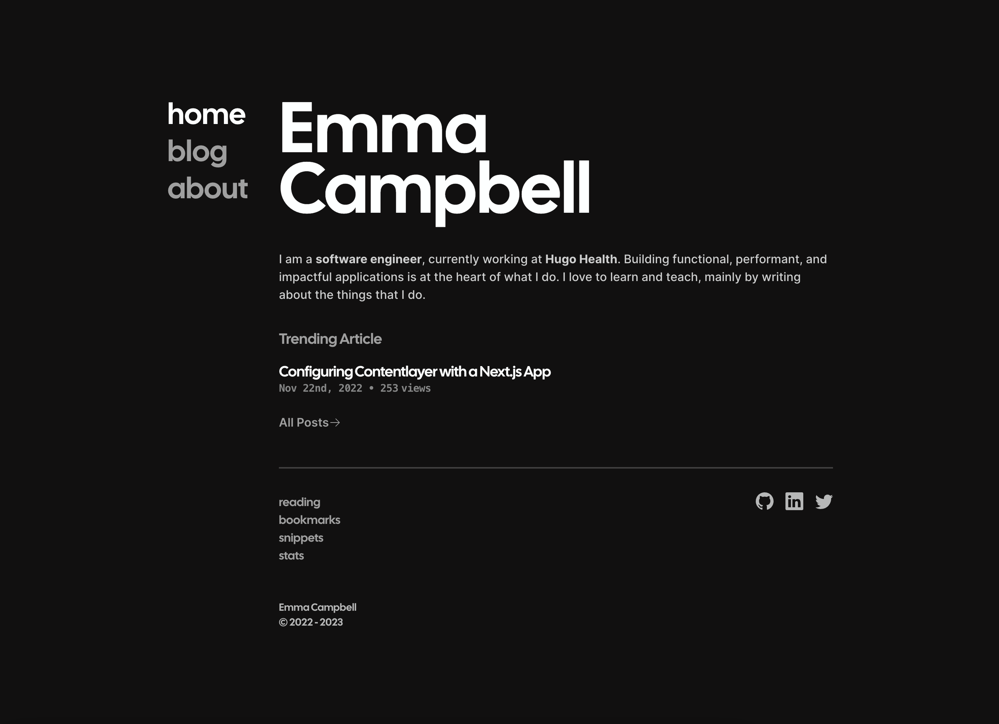

# Codegarden 🌱



My personal internet existence. A codegarden is a digital space for a developer to grow and nourish themselves into the best programmer they can be.

## What's it Built With?

Wanna know what I used to build it without diving too far into the source code? Yeah?! Well, here you go.

- Static Site Rendering: [Next.js](https://nextjs.org)
- Deployment: [Vercel](https://vercel.com/)
- CMS/Content: [contentlayer](https://www.contentlayer.dev)
- Styles: [tailwindcss](https://tailwindcss.com)
- Database: [Planetscale](https://planetscale.com)
- ORM: [Prisma](https://www.prisma.io)

Not to mention my blood, sweat, and tears. Maybe some banging my head on the table as well.

## Running Locally

There a few minor steps to getting up and running.

### 1. Clone the Repo

```sh
git clone https://github.com/emma-campbell/codegarden
```

### 2. Install Dependencies

```sh
yarn # npm i
```

### 3. Configure the Env

If you want to mess around with database features (metrics like views and likes) then you'll need to set up a PlanetScale database.

Luckily, I have a quick blurb about setting up the database and necessary links [here](https://www.emmacampbell.dev/blog/blog-metrics#setting-up-the-database). Keep your database url in a safe place. You'll want to duplicate the `.env.example` file and replace anything in angled brackets `<replace_me>` with the needed value.

### 4. Start the Server

```sh
yarn dev
```

## Contributing

If you see an open issue and want to tackle it, please be my guest! I am happy to help you boast the number of repo's your contributing to (while, admittably there are other more import open-source projects to constribute to).

My contribution guidelines are a working in progress, but any current standards are documented on my [contributions page](./CONTRIBUTING.md)

## License

Please reference my [license](./LICENSE.md) for relevant information.
